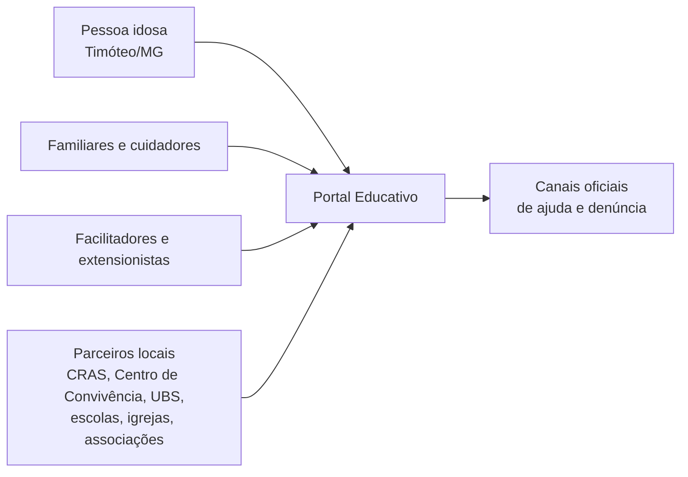
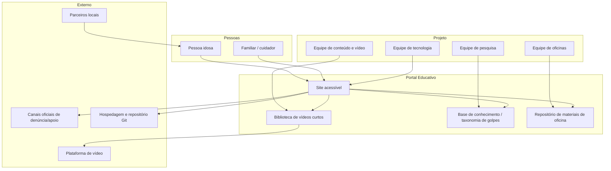
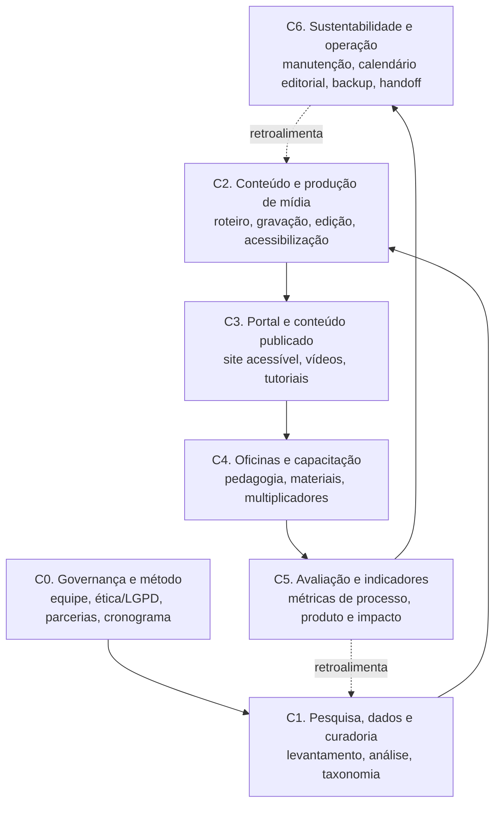
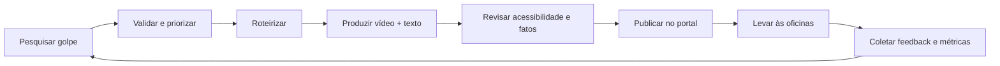
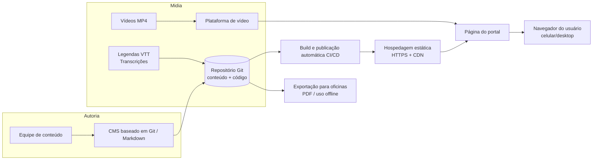
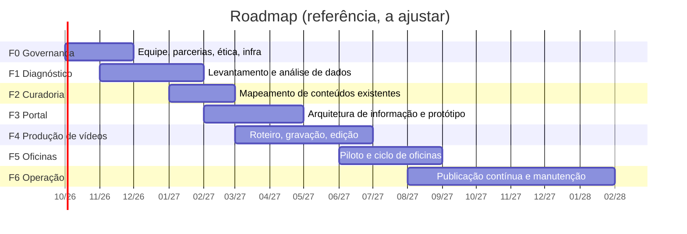

# Arquitetura do Projeto — Promover a Educação Digital de Idosos contra Golpes Online

> **Documento de arquitetura (somente planejamento).** Este documento **define e registra** a
> arquitetura do projeto. Não contém implementação e não deve ser confundido com o produto final.
>
> - Versão: 0.1 (rascunho para revisão da equipe)
> - Data: 2026-09-20
> - Local de aplicação: Timóteo/MG
> - Status: **Proposta — aguardando validação das decisões abertas (Seção 16)**

---

## 1. Identificação e resumo executivo

| Item | Descrição |
|---|---|
| Título | Promover a Educação Digital de Idosos contra Golpes Online |
| Público-alvo | Pessoas idosas (60+), com ênfase em baixa literacia digital; familiares/cuidadores como público secundário |
| Localização | Timóteo/MG |
| ODS selecionados | **03** Saúde e bem-estar · **04** Educação de qualidade · **10** Redução das desigualdades |
| Natureza | Projeto de educação digital + comunicação + extensão comunitária |
| Produto central | Portal web acessível com vídeos curtos + oficinas de aprendizagem |
| Princípio norteador | **Servir primeiro quem tem mais dificuldade de acesso** (acessibilidade, linguagem simples, baixo consumo de dados) |

**Síntese da arquitetura:** o projeto é tratado em **duas camadas de arquitetura complementares** —
uma **arquitetura de projeto** (pesquisa → curadoria → produção de conteúdo → oficinas → manutenção)
e uma **arquitetura de solução** (portal estático acessível com vídeos legendados, hospedagem de baixo
custo e publicação replicável por pessoas não técnicas). A arquitetura prioriza **sustentabilidade**
(continuar vivo após a saída da turma atual), **privacidade** (não coletar dados pessoais) e
**acessibilidade** (WCAG 2.2 AA como piso).

---

## 2. Objetivos do projeto (registro)

1. Levantar informações sobre golpes digitais comuns à terceira idade.
2. Analisar dados para identificar vulnerabilidades do público-alvo.
3. Mapear conteúdos existentes para apoiar o portal educativo.
4. Desenvolver um site acessível com vídeos curtos sobre golpes digitais.
5. Produzir vídeos educativos com linguagem simples e exemplos reais.
6. Ensinar a utilizar e compartilhar o conteúdo do portal em oficinas de aprendizagem.
7. Atualizar periodicamente o portal com novos conteúdos.

**Rastreabilidade:** cada objetivo é mapeado para componentes da arquitetura e entregáveis na
Seção 17 (Roadmap). Nenhum objetivo fica sem responsável arquitetural.

---

## 3. Escopo e não-escopo

### 3.1 Dentro do escopo
- Portal educativo público, acessível, em português (pt-BR), mobile-first.
- Catálogo de golpes digitais com vídeos curtos, resumos em texto, transcrições e orientações de ação.
- Tutoriais de segurança digital básica (senhas, verificação de links, WhatsApp, PIX).
- Materiais de apoio às oficinas (roteiros, cartilhas, apresentações, listas de verificação).
- Instrumentos de pesquisa e base de conhecimento sobre golpes e vulnerabilidades.
- Diretório de canais oficiais de ajuda e denúncia.

### 3.2 Fora do escopo (nesta fase)
- Aplicativo móvel nativo.
- Área de login, autenticação ou dados pessoais de usuários.
- Serviço de atendimento/denúncia próprio (o projeto **encaminha** para canais oficiais, não atua como canal).
- Assessoria jurídica ou recuperação financeira.
- Detecção automatizada de golpes em tempo real.
- Comércio, doações financeiras ou monetização.

---

## 4. Stakeholders e partes interessadas



| Grupo | Interesse | Relação com a arquitetura |
|---|---|---|
| Pessoas idosas | Aprender a se proteger | Define requisitos de acessibilidade, linguagem e formato de mídia |
| Familiares/cuidadores | Ajudar parentes | Público secundário; conteúdo compartilhável |
| Equipe executora (extensionistas) | Executar e manter | Define fluxo editorial e de publicação |
| Instituição proponente | Extensão, ensino e pesquisa | Governança, ética, infraestrutura, domínio |
| Parceiros locais | Acolhimento e alcance | Locais de oficina, divulgação, legitimidade |
| Órgãos oficiais | Orientar e receber denúncias | Alimentam o diretório de canais e a revisão factual |

---

## 5. Princípios e requisitos não funcionais

Estes princípios **decidem** a arquitetura e devem ser usados para avaliar qualquer mudança futura.

| # | Princípio | Implicação arquitetural |
|---|---|---|
| P1 | **Acessibilidade como piso, não como extra** | WCAG 2.2 nível AA; contraste alto; fonte grande ajustável; navegação por teclado e leitor de tela |
| P2 | **Simplicidade radical** | No máximo 3 níveis de navegação; uma ação principal por tela; sem jargão |
| P3 | **Privacidade desde a concepção (LGPD)** | Sem login, sem formulários de coleta de dados pessoais, sem rastreadores de terceiros |
| P4 | **Baixo custo e baixa manutenção** | Site estático; hospedagem gratuita/institucional; sem servidor para administrar |
| P5 | **Sustentabilidade e transferibilidade** | Conteúdo em arquivos versionados; documentação que permite outra equipe assumir |
| P6 | **Leveza de dados e resiliência** | Mobile-first; vídeos otimizados; transcrições em texto; opção de uso offline nas oficinas |
| P7 | **Correção e atualidade do conteúdo** | Revisão periódica; data de "atualizado em" visível; fonte/validação factual |
| P8 | **Inclusão digital ampla** | Alternativas impressas e presencial para quem não navega |

---

## 6. Visão geral da arquitetura (visão de contexto)



---

## 7. Arquitetura em camadas (visão macro)



Cada camada é detalhada nas Seções 8 a 14.

---

## 8. Camada C0 — Governança e método

### 8.1 Papéis (mínimos viáveis)

| Papel | Responsabilidade principal |
|---|---|
| Coordenação geral | Cronograma, parcerias, prestação de contas, ODS |
| Pesquisa e dados | Instrumentos, coleta, análise, LGPD |
| Curadoria e conteúdo | Taxonomia, roteiros, revisão de linguagem simples |
| Produção audiovisual | Gravação, edição, legendas, audiodescrição |
| Tecnologia/portal | Site, acessibilidade técnica, publicação, hospedagem |
| Oficinas | Mediação, materiais didáticos, avaliação |
| Acessibilidade (pode ser assessoria) | Revisão WCAG e testes com usuários |

> Em equipes pequenas, papéis podem ser acumulados, mas **as responsabilidades não podem ficar órfãs**.
> Recomenda-se 1 pessoa "guardiã da acessibilidade" e 1 "guardiã do conteúdo".

### 8.2 Método de projeto
A abordagem de gestão adotada é **Kanban** (justificativa, desenho do quadro e limites de WIP em
[`GESTAO-E-REQUISITOS.md`](GESTAO-E-REQUISITOS.md), Seção 1), combinada com **marcos acadêmicos** de
controle. O fluxo é incremental por tema de golpe (permite publicar valor cedo):



### 8.3 Ética, LGPD e conformidade
- **Pesquisa com seres humanos:** verificar necessidade de submissão a **Comitê de Ética em Pesquisa (CEP / Plataforma Brasil)** antes de qualquer coleta (entrevistas, grupos focais, questionários).
- **Termo de Consentimento Livre e Esclarecido (TCLE)** em linguagem simples, com versão impressa e leitura em voz alta quando necessário.
- **Minimização de dados:** coletar apenas o necessário; nunca publicar dados pessoais identificáveis.
- **Anonimização/pseudonimização** das bases antes de qualquer compartilhamento externo.
- **Armazenamento** em repositório institucional com controle de acesso; separar dados brutos (restritos) de dados publicáveis.
- **Portal sem coleta:** o site não deve pedir CPF, senha, telefone ou qualquer dado pessoal.

---

## 9. Camada C1 — Pesquisa, dados e curadoria

### 9.1 Objetivo
Produzir a **base de conhecimento** que sustenta todo o conteúdo (Objetivos 1, 2 e 3).

### 9.2 Instrumentos de coleta
| Instrumento | Finalidade | Observação |
|---|---|---|
| Questionário socioeconômico e digital | Perfil de uso e letramento digital | Impresso e/ou digital |
| Entrevista semiestruturada | Histórias de golpes, medos, dúvidas | Anonimizar |
| Grupos focais | Percepção sobre golpes e barreiras | Gravação apenas com consentimento |
| Análise documental | Boletins, reportagens, denúncias, cartilhas de órgãos oficiais | Registrar fonte e data |
| Observação em oficinas | Dificuldades reais de uso | Diário de campo |

### 9.3 Modelo de análise
- **Variáveis:** faixa etária, contato prévio com golpe, tipo de dispositivo, uso de WhatsApp/PIX, apoio familiar, letramento digital.
- **Produto da análise:** matriz de vulnerabilidade (tipo de golpe × perfil × canal de contato) que **prioriza** quais conteúdos produzir primeiro.
- **Taxonomia de golpes** (ver Seção 10.3) como artefato central de organização.

### 9.4 Curadoria de conteúdos existentes (Objetivo 3)
- Catálogo de fontes já existentes (cartilhas, vídeos, materiais de órgãos públicos, bancos, NIC.br/SaferNet, Procon).
- Para cada fonte: **título, autor, licença de uso, data, link, resumo, decisão** (reutilizar / adaptar / referenciar / descartar).
- **Atenção a direitos autorais:** reutilizar apenas conteúdos com licença compatível; quando não houver, **referenciar** com crédito em vez de copiar.
- Regra: **não reinventar** o que já existe e é bom; adaptar à realidade de Timóteo.

---

## 10. Camada C2/C3 — Conteúdo educacional e arquitetura da informação

### 10.1 Modelo editorial (formatos)
| Formato | Uso | Acessibilidade |
|---|---|---|
| Vídeo curto (60–90s) | Explicar um golpe | Legendas (VTT), transcrição, capa textual |
| Resumo em texto (5 passos) | Reforço e leitura | Linguagem simples, títulos claros |
| Transcrição / áudio | Quem não vê ou não lê bem | Publicada junto do vídeo |
| Lista de verificação ("como reconhecer") | Aplicação prática | Imprimível |
| Cartilha em PDF | Oficinas e quem não navega | Fonte grande, alto contraste, PDF acessível |
| Glossário | Termos técnicos | Definições curtas |

### 10.2 Linguagem e tom
- Frases curtas, voz ativa, 2ª pessoa ("Você").
- Evitar termos técnicos; quando inevitáveis, explicar no glossário.
- Toda página responde: **O que é? Como reconhecer? O que fazer agora?**
- Alerta de segurança visível: **"Nunca informe senha ou código por telefone."**

### 10.3 Taxonomia de golpes (estrutura inicial, a validar na pesquisa)

Dimensões de classificação:
- **Canal de contato:** telefone, SMS, WhatsApp, e-mail, redes sociais, site falso, presencial.
- **Isca/gancho:** falso parente, falso funcionário de banco, falso prêmio, falso boleto, falso empréstimo, falsa central, falso amor, falso suporte de app.
- **Prejuízo:** financeiro, vazamento de dados, acesso a contas, dano emocional.
- **Nível de risco:** alto / médio / baixo (para priorização).

> Os nomes e a lista final de golpes serão definidos na Camada C1 (pesquisa).

### 10.4 Arquitetura da informação do portal (mapa do site — proposto)

```
/                       Home: propósito + botão "Preciso de ajuda agora" + catálogo
/golpes/                Lista de todos os golpes (filtro simples por canal/tema)
/golpes/<slug>/         Página do golpe: vídeo + resumo + o que fazer + transcrição
/aprenda/               Tutoriais básicos (senha, links, WhatsApp, PIX, compras)
/aprenda/<slug>/        Tutorial específico
/ajuda/                 Canais oficiais de ajuda e denúncia + passo a passo
/oficinas/              Informações das oficinas e materiais para facilitadores
/oficinas/materiais/    Roteiros, slides, cartilhas, listas de verificação
/glossario/             Termos explicados
/sobre/                 Equipe, parceiros, ODS, relatórios, como colaborar
/acessibilidade/        Recursos de acessibilidade e como usá-los
/atualizacoes/          Novidades e registro de revisões
```

**Regras de navegação:** cabeçalho com no máximo 5 destinos principais; busca simples; rodapé com canais de ajuda; nenhum elemento piscante ou com tempo limitado.

### 10.5 Modelo de dados de conteúdo (exemplo — coleção "golpes")

```yaml
# src/content/golpes/falso-funcionario-banco.md
titulo: "Falso funcionário de banco"
slug: "falso-funcionario-banco"
resumoCurto: "Alguém liga dizendo ser do banco e pede seus dados ou uma transferência."
canal: ["telefone", "whatsapp"]
gancho: "falso-funcionario"
nivelRisco: "alto"
video:
  id: "VIDEO_ID"
  duracaoSegundos: 75
  capa: "/img/golpes/falso-funcionario-banco.jpg"
  transcricao: true
  legendaVtt: "/videos/legendas/falso-funcionario-banco.vtt"
comoReconhecer:
  - "Pedem senha, código do SMS ou para instalar um aplicativo."
  - "Pedem para você 'transferir para uma conta segura'."
oQueFazerAgora:
  - "Desligue a ligação e não clique em nada."
  - "Ligue para o banco usando o número que está no cartão."
  - "Se houve prejuízo, registre boletim de ocorrência."
publicoAlvo: ["idoso", "cuidador"]
ods: [3, 4, 10]
atualizadoEm: 2026-09-20
revisadoPor: "Equipe de pesquisa"
fontes:
  - "Órgão oficial X — Cartilha de golpes (2025)"
```

> Esse **contrato de conteúdo** é o coração da arquitetura: ele desacopla o conteúdo da tecnologia e permite trocar de ferramenta no futuro sem reescrever tudo.

---

## 11. Camada C3 — Arquitetura técnica do portal

### 11.1 Requisitos técnicos derivados
- Acessível (WCAG 2.2 AA), rápido, funciona bem em celular e internet lenta.
- Publicável por pessoas não técnicas (docentes/extensionistas).
- Sem servidor para administrar; custo próximo de zero; seguro por padrão.
- Conteúdo versionado e reversível (histórico de mudanças).

### 11.2 Opções arquiteturais

| Opção | Descrição | Prós | Contras | Avaliação |
|---|---|---|---|---|
| **A — ADOTADA** | Site estático (**Astro**) + conteúdo em Markdown/JSON + **CMS baseado em Git** (ex.: Decap) + hospedagem estática (Cloudflare Pages / Netlify / GitHub Pages) | Acessível e rápido; baixo custo; sem manutenção de servidor; edição por formulário; versionamento nativo | Exige configuração inicial por alguém técnico | **Adotada** (ver decisão D1/D2) |
| B | **WordPress** institucional | Interface familiar para edição; plugins de acessibilidade | Atualizações de segurança; hospedagem; backup; risco de obsolescência | Alternativa descartada nesta fase |
| C | Next.js/SSR + CMS headless | Flexível e escalável | Complexidade e custo desnecessários para o escopo | **Não recomendada** nesta fase |

**Decisão registrada (D1/D2) — ADOTADA:** portal **estático (Astro)** com conteúdo em Markdown e **CMS baseado em Git** para edição por pessoas não técnicas. Hospedagem estática, **preferencialmente com domínio e conta institucionais** para garantir continuidade. Consequências: o conteúdo fica desacoplado da tecnologia (pode migrar sem reescrever), e a publicação depende de um fluxo de build + deploy automatizado (ver Seção 11.3).

### 11.3 Componentes da solução



### 11.4 Componentes de interface (conceituais)
- `VideoAcessivel` — player grande, sem autoplay, com legenda e transcrição.
- `ResumoEmPassos` — bloco "como reconhecer".
- `OQueFazerAgora` — passos de ação.
- `AlertaAjuda` — botão fixo "Preciso de ajuda agora" → /ajuda.
- `ControleDeAcessibilidade` — aumentar fonte, alto contraste, modo leitura simples.
- `CatalogoGolpes` — lista filtrável simples.
- `BuscaSimples` — busca por palavra-chave.

### 11.5 Publicação de vídeo — **decisão adotada (D3): YouTube em modo sem cookies**

Os vídeos serão publicados em **canal institucional no YouTube** e incorporados no portal via
**`youtube-nocookie.com`**, sempre **sem autoplay**. Essa escolha prioriza alcance e custo zero; o
preço é a dependência de plataforma de terceiros, mitigada pelos controles abaixo.

**Regras obrigatórias de incorporação:**
- Usar o domínio `youtube-nocookie.com` (sem cookies de rastreamento até o usuário dar play).
- **Sem autoplay** e **sem player com início automático**; a pessoa decide quando assistir.
- Controlar a tela final e os vídeos sugeridos com `rel=0` para reduzir recomendações fora do tema.
- Nunca usar "shorts" verticais como formato principal (ruim para leitura de legenda e para telas grandes).
- **Legendas:** o arquivo **VTT é a fonte da verdade** e fica versionado no repositório, mas, em um
  iframe do YouTube, o portal **não consegue injetar legenda própria** — o VTT precisa ser **enviado
  como faixa de legenda no próprio YouTube**. Forçar a legenda ligada por padrão com
  `cc_load_policy=1` e `cc_lang_pref=pt`.
- **Garantia de acessibilidade independente da plataforma:** publicar **sempre a transcrição completa
  na página**, em HTML, sob nosso controle. A transcrição é o que assegura acesso mesmo se a legenda
  do YouTube falhar ou for desativada.

**Preservação do acervo (mitigação de risco R5):**
- Manter cópia dos **arquivos mestres** (MP4 H.264/AAC, projeto de edição, roteiro e VTT) em
  armazenamento institucional — o YouTube é vitrine, não arquivo.
- Padronizar thumbnail/capa textual com o nome do golpe (funciona como reforço para quem não assiste ao vídeo).
- Duração alvo: **60–90s**. Se o tema exigir mais, dividir em partes numeradas.

### 11.6 Acessibilidade (checklist técnico)
- HTML semântico, hierarquia de títulos correta, textos alternativos.
- Contraste mínimo 7:1 quando possível (AA exige 4.5:1); fonte base ≥ 20px; botão de aumento.
- Foco visível; operável 100% por teclado; compatível com leitores de tela.
- Legendas e transcrições em todos os vídeos; audiodescrição quando a informação for visual.
- Sem conteúdo que pisca, sem tempo limite, sem CAPTCHA complexo.

> O detalhamento completo (checklist WCAG 2.2 AA, guia de linguagem simples, especificação de mídia
> acessível, protocolo de testes e governança) está em [`docs/ACESSIBILIDADE.md`](ACESSIBILIDADE.md).

### 11.7 Segurança e privacidade do próprio portal
- O portal **não coleta dados pessoais** → reduz risco e obrigações de LGPD.
- HTTPS obrigatório; sem cookies de terceiros; sem rastreamento publicitário.
- Formulários: se houver contato, usar e-mail institucional; nunca pedir senha/dados sensíveis.
- Aviso claro de que o projeto **nunca** liga pedindo senha ou transferência (evitar uso da marca em novos golpes).

### 11.8 Métricas técnicas (sem invadir privacidade)
- Preferir analytics **livre de cookies** (ex.: Umami/Plausible auto-hospedado) ou **nenhum** analytics.
- Métricas de vaidade (visualizações) são secundárias frente a **indicadores de aprendizagem** (Seção 14).

---

## 12. Camada C4 — Oficinas e capacitação

### 12.1 Desenho pedagógico
- **Andragogia:** partir de experiências reais; aprender fazendo; ritmo próprio; repetição.
- **Estrutura sugerida:** 4 a 6 encontros presenciais, 60–90 min, turmas pequenas.
- **Sequência por encontro:** acolhimento → situação real → vídeo → prática guiada → resumo → tarefa para casa.
- **Formato de saída:** idosos **multiplicadores** que ensinam familiares e vizinhos (amplia o alcance).

### 12.2 Materiais (repositório de oficinas)
- Roteiro do facilitador (passo a passo, tempo, perguntas).
- Apresentação simples (fonte grande, alto contraste).
- Cartilha impressa e lista de verificação.
- Atividades práticas com celular (ex.: verificar link, configurar senha).
- Formulários de avaliação pré/pós.

### 12.3 Locais e parcerias
- Priorizar locais já frequentados pelo público: CRAS, Centro de Convivência do Idoso, UBS, associações, igrejas, escolas (para idosos e familiares).

### 12.4 Compartilhamento (Objetivo 6)
- Ensinar explicitamente a **compartilhar** o conteúdo (link, QR code, cartaz com QR).
- Produzir material "compartilhe com quem você ama" (mensagem pronta para WhatsApp).

---

## 13. Camada C6 — Sustentabilidade e operação

| Aspecto | Prática definida |
|---|---|
| Versionamento | Todo conteúdo e código em repositório Git com histórico |
| Calendário editorial | Revisão de todos os conteúdos a cada **3 meses** (golpes evoluem rápido) |
| Aviso de atualidade | Data "Atualizado em" visível em cada página |
| Backup | Cópias dos vídeos mestres, bases de dados e PDFs em armazenamento institucional |
| Manutenção mínima | Atualizar dependências do site; validar links e canais de denúncia |
| Transferência (handoff) | Manual de operação + vídeo-tutorial interno para a próxima equipe |
| Governança de conteúdo | Fluxo de aprovação: autor → revisor de linguagem → revisor de acessibilidade → publicação |
| Licença | Definir licença de uso do conteúdo (ex.: Creative Commons) para permitir reuso |

---

## 14. Avaliação e indicadores

### 14.1 Alinhamento com os ODS

| ODS | Contribuição | Indicador-chave |
|---|---|---|
| **03 Saúde e bem-estar** | Reduz dano financeiro e sofrimento psíquico causado por golpes | Autopercepção de segurança; nº de pessoas que relataram evitar golpe |
| **04 Educação de qualidade** | Educação digital continuada para adultos e idosos | Ganho de conhecimento pré/pós-oficina |
| **10 Redução das desigualdades** | Inclui digitalmente quem tem menos acesso | Nº de idosos alcançados; acesso por dispositivos simples; material impresso |

### 14.2 Tipos de indicador

| Dimensão | Exemplos |
|---|---|
| **Processo** | Nº de golpes catalogados, nº de vídeos produzidos, nº de oficinas realizadas, nº de parceiros |
| **Produto** | Nº de páginas publicadas, nº de acessos, nº de downloads, taxa de conclusão do vídeo |
| **Impacto** | Ganho de conhecimento (pré/pós), usabilidade (escala SUS), acessibilidade (conformidade WCAG + testes com usuários), relato de mudança de comportamento |
| **Sustentabilidade** | Periodicidade de atualização cumprida, nº de pessoas capacitadas a manter o portal |

> Regra: **medir aprendizagem, não apenas audiência.** Métricas de impacto têm prioridade sobre métricas de vaidade.

---

## 15. Riscos e mitigações

| # | Risco | Prob. | Impacto | Mitigação |
|---|---|---|---|---|
| R1 | Conteúdo desatualizado (golpes mudam) | Alta | Alto | Revisão trimestral + data visível + calendário editorial |
| R2 | Baixa adesão do público | Média | Alto | Parcerias locais, WhatsApp, cartazes com QR, oferta presencial |
| R3 | Equipe voluntária se desfaz (perda de conhecimento) | Alta | Alto | Documentação, repositório versionado, manual de handoff |
| R4 | Exclusão digital (idoso não acessa internet) | Alta | Médio | Cartilha impressa, oficinas presenciais, apoio por telefone |
| R5 | Dependência de plataforma de vídeo | Média | Médio | Guardar arquivos mestres; player próprio como alternativa |
| R6 | Falha de acessibilidade | Média | Alto | Checklist WCAG + testes com usuários reais e leitor de tela |
| R7 | Questões de LGPD/ética na pesquisa | Média | Alto | CEP, TCLE, anonimização, minimização de dados |
| R8 | Baixo orçamento/infra | Média | Médio | Arquitetura estática gratuita/institucional |
| R9 | Portal usado indevidamente em nome do projeto | Baixa | Alto | Aviso "nós nunca pedimos senha"; canal oficial de contato |
| R10 | Direitos autorais de conteúdo reutilizado | Média | Médio | Catálogo de licenças; referenciar em vez de copiar |

---

## 16. Decisões arquiteturais (registro de ADRs)

| ID | Decisão | Situação | Observação |
|---|---|---|---|
| D1 | Portal **estático** (Astro) vs WordPress | **DECIDIDA: estático (Astro)** | Com CMS baseado em Git para edição por não técnicos |
| D2 | Hospedagem: Cloudflare Pages / Netlify / GitHub Pages vs institucional | **DECIDIDA: hospedagem estática** | Preferir domínio/conta institucional para continuidade |
| D3 | Vídeo: player próprio vs plataforma incorporada | **DECIDIDA: YouTube `youtube-nocookie`, sem autoplay** | Legendas VTT no próprio portal; manter arquivos mestres |
| D4 | Idioma e variante | **Decidida:** pt-BR | — |
| D5 | Coleta de dados no portal | **Decidida:** nenhuma | Reduz LGPD e risco de segurança |
| D6 | Analytics | Pendente | Recomendação: sem cookies ou nenhum |
| D7 | Licença do conteúdo | Pendente | Recomendação: Creative Commons para permitir reuso |
| D8 | Identidade visual e marca | Pendente | Definir antes da produção de vídeos |
| D9 | Abordagem de gestão | **DECIDIDA: Kanban** | Fluxo contínuo de conteúdo + marcos acadêmicos (ver `GESTAO-E-REQUISITOS.md`, 1) |

---

## 17. Roadmap por fases e entregáveis



| Fase | Foco | Entregáveis principais | Objetivos atendidos |
|---|---|---|---|
| F0 | Governança | Equipe definida, parcerias, infraestrutura, ética/LGPD | Base para todos |
| F1 | Diagnóstico | Instrumentos, base de dados anonimizada, matriz de vulnerabilidade, taxonomia de golpes | 1, 2 |
| F2 | Curadoria | Catálogo de fontes com licenças e decisões (reutilizar/adaptar/referenciar) | 3 |
| F3 | Portal | Arquitetura de informação, protótipo acessível, testes de usabilidade | 4 |
| F4 | Produção | Vídeos curtos legendados + transcrições + textos e cartilhas | 5 |
| F5 | Oficinas | Roteiros, materiais, ciclo piloto, avaliação pré/pós, multiplicadores | 6 |
| F6 | Operação | Calendário editorial, revisões, novos conteúdos, manual de handoff | 7 |

**MVP sugerido (primeiro valor publicável):** 5 golpes prioritários + 3 tutoriais + 1 roteiro de oficina + canais de ajuda, com acessibilidade validada.

---

## 18. Estrutura de repositório proposta

```
/
├── README.md                      # visão geral e como navegar no projeto
├── docs/
│   ├── ARQUITETURA.md             # este documento
│   ├── ACESSIBILIDADE.md          # checklist e padrões
│   ├── GESTAO-E-REQUISITOS.md     # gestão, requisitos, modelagem, planejamento e evidências
│   ├── GOVERNANCA.md              # papéis, cronograma, ética/LGPD
│   └── MANUAL-DE-OPERACAO.md      # handoff e manutenção
├── evidencias/                    # provas de aplicação (ver GESTAO-E-REQUISITOS.md, Seção 5)
│   ├── portal/
│   ├── videos/
│   ├── oficinas/                  # dados pessoais = acesso restrito
│   └── parcerias/
├── pesquisa/
│   ├── instrumentos/              # questionários, roteiros de entrevista
│   ├── dados-brutos/              # acesso restrito (não versionar dados pessoais)
│   ├── analises/                  # planilhas e resultados anonimizados
│   └── curadoria/                 # catálogo de fontes e licenças
├── producao/
│   ├── roteiros/                  # roteiros dos vídeos
│   ├── storyboards/
│   └── midia-mestre/              # acesso restrito / armazenamento externo
├── oficinas/
│   ├── roteiros-facilitador/
│   ├── apresentacoes/
│   └── cartilhas/
├── site/                          # a implementar na Fase F3 (fora deste escopo agora)
│   ├── src/content/golpes/
│   ├── src/content/aprenda/
│   ├── src/content/oficinas/
│   └── public/videos/legendas/
└── .gitignore
```

> **Observação:** a pasta `site/` está apenas prevista. Nada deve ser implementado até a
> validação das decisões abertas (Seção 16).

---

## 19. Próximos passos (sem implementação)

1. Validar as decisões ainda abertas D6 (analytics), D7 (licença) e D8 (identidade visual).
2. Confirmar equipe e responsáveis por papel (Seção 8.1) e nomear os responsáveis de gestão G1–G5 (`GESTAO-E-REQUISITOS.md`, Seção 8).
3. Verificar exigência de Comitê de Ética antes de qualquer coleta.
4. Levantar parcerias locais em Timóteo/MG para as oficinas.
5. Definir a identidade visual e o tom de voz antes da produção de vídeos.
6. Fechar a taxonomia inicial de golpes com base na pesquisa (F1).
7. Planejar a coleta de evidências desde a F0, com autorização de imagem (ver `GESTAO-E-REQUISITOS.md`, Seção 5).

---

### Histórico de revisões

| Versão | Data | Alteração |
|---|---|---|
| 0.1 | 2026-09-20 | Versão inicial da arquitetura (planejamento) |
| 0.2 | 2026-09-20 | Decisões D1/D2 (portal estático + CMS Git) e D3 (YouTube sem cookies) fixadas; acessibilidade detalhada em `docs/ACESSIBILIDADE.md` |
| 0.3 | 2026-09-20 | Gestão, requisitos, modelagem, planejamento, evidências e aderência ao roteiro do Trabalho Final registrados em `docs/GESTAO-E-REQUISITOS.md`; decisão D9 (Kanban) |
