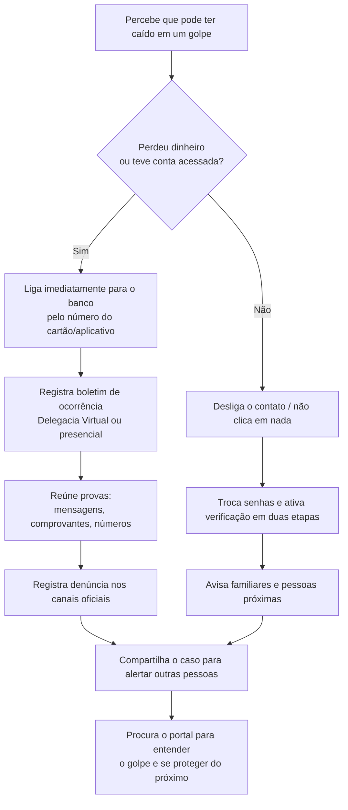
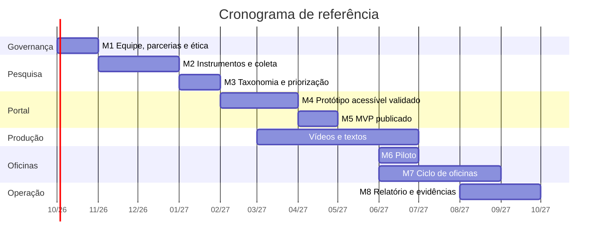

# Gestão, Engenharia de Requisitos e Planejamento — Trabalho Final

> Documento de **definição** (planejamento). Atende às seções **5.1 a 5.5**, **6** e **7** do roteiro
> do Trabalho Final e complementa [`ARQUITETURA.md`](ARQUITETURA.md) e [`ACESSIBILIDADE.md`](ACESSIBILIDADE.md).
>
> - Versão: 0.1 · Data: 2026-09-20
> - Projeto: Promover a Educação Digital de Idosos contra Golpes Online — Timóteo/MG
> - ODS: 03 · 04 · 10

---

## 0. Mapa de aderência ao roteiro

| Item do roteiro | Onde é atendido | Status |
|---|---|---|
| 5.1 Abordagem de gestão | Seção 1 deste documento | Definido |
| 5.2 Engenharia de requisitos | Seção 2 | Definido |
| 5.3 Modelagem e diagramas | Seção 3 + `ARQUITETURA.md` (Seção 6) | Parcial (wireframes na F3) |
| 5.4 Planejamento mínimo viável | Seção 4 | Definido (valores a orçar) |
| 5.5 Evidências de aplicação | Seção 5 | Plano definido |
| 6. Critérios de avaliação | Seção 6 | Mapeado |
| 7. Checklist de envio | Seção 7 | Definido |

---

## 1. Seleção de abordagem de gestão (5.1)

### 1.1 Comparação

| Abordagem | Adequação ao projeto | Veredito |
|---|---|---|
| **Cascata** | Exige escopo estável. Aqui o conteúdo muda (novos golpes surgem) e o portal é atualizado continuamente (Objetivo 7) | **Inadequada como abordagem principal** |
| **Scrum** | Bom para iterações curtas, mas adiciona papéis, cerimônias e artefatos que pesam em equipe pequena e voluntária com disponibilidade irregular | **Overhead desnecessário** |
| **Kanban** | Fluxo visual e simples; acomoda demanda variável; adequado a trabalho contínuo de produção de conteúdo; mínimo de cerimônias | **ADOTADA** |

### 1.2 Decisão (D9): Kanban

**Justificativa:** o projeto é um **fluxo contínuo de produção e curadoria de conteúdo**, não um
produto com data única de entrega. A equipe é pequena e de disponibilidade irregular, e o escopo de
conteúdo é intencionalmente evolutivo (atualização periódica). Kanban dá visibilidade e prazos com o
mínimo de burocracia — exatamente a "regra de ouro" do roteiro.

**Desenho do quadro:**

| Coluna | Significado |
|---|---|
| Backlog | Tudo que foi identificado e ainda não começou |
| A fazer | Priorizado para o ciclo atual |
| Em pesquisa | Levantamento de fatos e fontes (Camada C1) |
| Em produção | Roteiro, gravação, edição, redação |
| Em revisão | Revisão de **fatos** + **linguagem simples** + **acessibilidade** |
| Publicado | No ar (portal e/ou YouTube) |
| Avaliado em oficina | Já testado com o público e com feedback coletado |

**Regras operacionais:**
- **Limites de WIP:** Em produção = 2 · Em revisão = 3 · Em pesquisa = 2 (evita acúmulo e gargalo).
- **Cadência:** reunião semanal de 30 min (revisar quadro e bloqueios); **revisão trimestral** de todo o conteúdo publicado.
- **Definition of Done:** o checklist de acessibilidade de [`ACESSIBILIDADE.md`](ACESSIBILIDADE.md), Seção 11.
- **Métricas de fluxo:** tempo de percurso (*lead time*), itens concluídos por mês (*throughput*) e nº de conteúdos com revisão vencida.
- **Ferramenta:** quadro físico ou ferramenta gratuita (Trello/quadro Kanban) — decisão operacional, não arquitetural.

> **Híbrido necessário:** os **marcos acadêmicos** (entrega do Trabalho Final, apresentação) e o
> **cronograma do projeto** (Seção 4.2) são datas fixas e continuam valendo como pontos de controle
> sobre o fluxo Kanban.

---

## 2. Engenharia de requisitos (5.2)

### 2.1 Visão do produto

> Para **pessoas idosas de Timóteo/MG** que estão expostas a golpes digitais e têm pouca familiaridade
> com tecnologia, o **Portal Educativo + Oficinas** é um **site acessível com vídeos curtos e materiais
> de formação** que **ensina a reconhecer, evitar e reagir a golpes online**. Diferente de cartilhas
> genéricas, ele usa **linguagem simples, exemplos reais e formação presencial com apoio local**.

### 2.2 Personas

| Persona | Perfil | Objetivos | Dores | Como o portal atende |
|---|---|---|---|---|
| **Dona Maria, 68** | Aposentada, baixa visão, usa WhatsApp no celular, mora sozinha | Não cair em golpe; entender mensagens que recebe | Medo de errar, letras pequenas, não sabe a quem pedir ajuda | Fonte grande, vídeo curto, botão de ajuda, linguagem simples |
| **Seu Antônio, 74** | Usa celular básico, pouca internet, prefere papel | Aprender sem depender de internet | Exclusão digital, vergonha de perguntar | Cartilha impressa, oficina presencial, materiais para download |
| **Fernanda, 43** | Filha cuidadora, trabalha fora | Proteger a mãe; ensinar de longe | Falta de tempo; não sabe explicar de forma simples | Conteúdo compartilhável no WhatsApp, resumos, QR code |
| **Professora Ana, 35** | Facilitadora extensionista | Aplicar oficinas com material pronto | Falta de tempo para preparar tudo | Roteiros de facilitador, slides, listas de verificação |

### 2.3 Requisitos funcionais (RF)

| ID | Requisito funcional | Persona principal | Fase |
|---|---|---|---|
| RF-01 | Exibir catálogo de golpes com nomes em linguagem comum | Dona Maria | F3 |
| RF-02 | Exibir página de golpe com vídeo, resumo, transcrição e "o que fazer" | Dona Maria | F3/F4 |
| RF-03 | Permitir ajustar tamanho da fonte e contraste | Dona Maria | F3 |
| RF-04 | Oferecer busca simples por palavra-chave | Fernanda | F3 |
| RF-05 | Reunir canais oficiais de ajuda e denúncia com passo a passo | Todas | F3 |
| RF-06 | Disponibilizar tutoriais de segurança digital básica | Dona Maria | F3/F4 |
| RF-07 | Permitir compartilhar o conteúdo (link e QR code) | Fernanda | F3 |
| RF-08 | Disponibilizar materiais de oficina para download | Professora Ana | F5 |
| RF-09 | Publicar glossário de termos | Dona Maria | F3 |
| RF-10 | Publicar página de atualizações e data de revisão de cada conteúdo | Professora Ana | F3/F6 |
| RF-11 | Publicar Declaração de Acessibilidade e canal para relatar barreiras | Todas | F3 |
| RF-12 | Permitir que a equipe publique conteúdo pelo CMS, sem programar | Professora Ana | F3/F6 |

### 2.4 Requisitos não funcionais (RNF)

| ID | Categoria | Requisito mensurável |
|---|---|---|
| RNF-01 | Acessibilidade | Conformidade **WCAG 2.2 AA**, meta interna 7:1 de contraste e fonte base ≥ 20px |
| RNF-02 | Acessibilidade | 100% navegável por teclado e compatível com NVDA/TalkBack |
| RNF-03 | Acessibilidade de mídia | Todo vídeo com legenda **e** transcrição em HTML |
| RNF-04 | Desempenho | Página inicial utilizável em conexão 3G/4G lenta; imagens otimizadas |
| RNF-05 | Usabilidade | No máximo 3 níveis de navegação; 1 ação principal por tela |
| RNF-06 | Compreensão | Linguagem simples, frases de até 15–20 palavras; estrutura fixa "o que é / como reconhecer / o que fazer" |
| RNF-07 | Privacidade/LGPD | Portal **não coleta dados pessoais**; sem login; sem rastreadores de terceiros |
| RNF-08 | Segurança | HTTPS obrigatório; sem cookies de terceiros; sem formulário com dados sensíveis |
| RNF-09 | Compatibilidade | Funcionar nos navegadores/dispositivos reais do público (a confirmar na pesquisa) |
| RNF-10 | Manutenibilidade | Conteúdo versionado; publicação por pessoa não técnica; manual de operação |
| RNF-11 | Disponibilidade/atualidade | Conteúdo revisado a cada 3 meses; data de atualização visível |
| RNF-12 | Localização | Interface em **pt-BR**, com exemplos e canais de **Timóteo/MG** |

### 2.5 Histórias de usuário e critérios de aceitação

| ID | História de usuário | Critérios de aceitação (resumo) |
|---|---|---|
| US-01 | Como pessoa idosa, quero **entender o que fazer se alguém pedir meu código por telefone**, para não perder dinheiro | Botão "Preciso de ajuda agora" na home a 1 toque; página responde em "o que é / como reconhecer / o que fazer"; texto legível em 200% de zoom |
| US-02 | Como pessoa idosa, quero **ver um vídeo curto sobre o golpe**, para entender sem ler muito | Vídeo ≤ 90s, sem autoplay, com legenda e **transcrição na página** |
| US-03 | Como pessoa com baixa visão, quero **aumentar a letra**, para conseguir ler | Controle no cabeçalho; escala até 200% sem quebra de layout; preferência lembrada |
| US-04 | Como filha cuidadora, quero **enviar o conteúdo para minha mãe**, para ajudá-la de longe | Botão "compartilhar no WhatsApp" com rótulo em texto; link curto funcional |
| US-05 | Como pessoa idosa, quero **saber a quem recorrer depois de um golpe** | Página `/ajuda/` com passos numerados e canais oficiais identificados |
| US-06 | Como facilitadora, quero **baixar o roteiro da oficina**, para aplicar com minha turma | Material em HTML e PDF acessível, com fonte grande; download em 1 clique |
| US-07 | Como pessoa idosa, quero **ter certeza de que o site é confiável**, para confiar no conteúdo | Declaração de acessibilidade e aviso "nós nunca pedimos senha"; identificação da instituição |
| US-08 | Como pessoa não técnica da equipe, quero **publicar um novo golpe**, para manter o portal atualizado | Publicação pelo CMS sem programar; acessibilidade e linguagem revisadas antes de publicar |

### 2.6 Backlog priorizado (MoSCoW)

| Prioridade | Itens | Observação |
|---|---|---|
| **Must (MVP)** | RF-01, RF-02, RF-03, RF-05, RNF-01..03, RNF-07 | Sem isso não há valor publicável |
| **Should** | RF-04, RF-06, RF-07, RF-09, RF-10, RF-11, RF-12 | Completam a experiência e a sustentabilidade |
| **Could** | RF-08, versão offline para oficinas, leitura em voz alta | Ganhos incrementais |
| **Won't (agora)** | App nativo, login, denúncia pelo portal, detecção automática | Fora de escopo declarado |

**MVP:** 5 golpes prioritários + 3 tutoriais + página `/ajuda/` + 1 roteiro de oficina, com
acessibilidade validada — coerente com o MVP definido em `ARQUITETURA.md`, Seção 17.

---

## 3. Modelagem e diagramas recomendados (5.3)

### 3.1 Inventário de diagramas

| Diagrama | Finalidade | Situação |
|---|---|---|
| Diagrama de contexto | Fronteira do sistema e atores externos | **Pronto** (`ARQUITETURA.md`, Seção 6) |
| Diagrama de camadas | Visão macro da solução | **Pronto** (`ARQUITETURA.md`, Seção 7) |
| Pipeline de conteúdo | Fluxo editorial | **Pronto** (`ARQUITETURA.md`, Seção 8.2) |
| Fluxo do processo (BPMN simplificado) | Passos de reação a um golpe | **Neste documento**, 3.2 |
| Casos de uso por perfil | Funcionalidades por ator | **Neste documento**, 3.3 |
| Jornada do usuário | Experiência da persona | A produzir na F3 |
| Wireframes | Validação de interface com o público | A produzir na F3 |
| Modelo de dados | — | **Não aplicável:** o portal é estático e não possui banco de dados (decisão D1/D5) |

> **Ponto favorável à banca:** a ausência de DER não é lacuna, é **decisão arquitetural justificada**
> (portal sem banco de dados, sem coleta de dados pessoais → menor risco de segurança e menor obrigação
> sob LGPD).

### 3.2 Fluxo do processo — "caí num golpe, e agora?"



### 3.3 Casos de uso por ator

| Ator | Casos de uso |
|---|---|
| **Visitante (pessoa idosa)** | Consultar catálogo de golpes · Assistir vídeo · Ler transcrição · Ajustar acessibilidade · Consultar canais de ajuda |
| **Cuidador/familiar** | Buscar conteúdo · Compartilhar conteúdo · Baixar material |
| **Facilitador** | Baixar roteiro e materiais · Consultar cronograma de oficinas |
| **Equipe (admin)** | Publicar conteúdo · Atualizar conteúdo · Registrar revisão |

### 3.4 Wireframes (a produzir na Fase F3)

Descrever em baixa fidelidade, com validação junto ao público-alvo:
- **Home:** título do projeto, uma frase de propósito, botão "Preciso de ajuda agora", lista de golpes em destaque, controle de acessibilidade.
- **Página de golpe:** título, vídeo, blocos "o que é / como reconhecer / o que fazer", transcrição, data de atualização.
- **Página de ajuda:** passos numerados e canais oficiais com o que fazem e quando usar.

---

## 4. Planejamento mínimo viável (5.4)

### 4.1 WBS simplificada

```
1. Governança
   1.1 Equipe e papéis
   1.2 Parcerias locais
   1.3 Ética e LGPD (CEP/TCLE)
   1.4 Infraestrutura e domínio
2. Pesquisa e dados
   2.1 Instrumentos
   2.2 Coleta
   2.3 Análise
   2.4 Taxonomia de golpes e priorização
3. Curadoria
   3.1 Catalogar conteúdos existentes
   3.2 Verificar licenças
   3.3 Decidir reutilizar/adaptar/referenciar
4. Portal
   4.1 Arquitetura de informação
   4.2 Wireframes e validação
   4.3 Implementação
   4.4 Validação de acessibilidade
5. Produção audiovisual
   5.1 Roteiros
   5.2 Gravação
   5.3 Edição e legendas
   5.4 Publicação e transcrição
6. Oficinas
   6.1 Materiais
   6.2 Piloto
   6.3 Ciclo de oficinas
   6.4 Avaliação pré/pós
7. Operação e evidências
   7.1 Revisão periódica
   7.2 Coleta de evidências
   7.3 Relatório final
```

### 4.2 Cronograma com marcos e responsabilidades

Datas de referência (início em out/2026). Ajustar conforme calendário acadêmico da instituição.

| Marco | Entrega | Responsável | Prazo |
|---|---|---|---|
| M1 | Equipe definida, parcerias firmadas, ética encaminhada | Coordenação | out/2026 |
| M2 | Instrumentos prontos e coleta iniciada | Pesquisa e dados | nov/2026 |
| M3 | Taxonomia de golpes e conteúdo priorizado | Pesquisa + Curadoria | jan/2027 |
| M4 | Protótipo acessível validado com usuários | Tecnologia + Acessibilidade | mar/2027 |
| M5 | Primeiros vídeos e textos publicados (MVP) | Produção + Tecnologia | abr/2027 |
| M6 | Piloto de oficina realizado e avaliado | Oficinas | jun/2027 |
| M7 | Ciclo de oficinas concluído com resultados | Oficinas | ago/2027 |
| M8 | Operação contínua, evidências consolidadas e relatório | Coordenação | set/2027 |



### 4.3 Recursos e custos

| Recurso | Tipo | Necessidade | Custo estimado |
|---|---|---|---|
| Celular/câmera para gravação | Equipamento | Pode ser próprio | R$ 0 (a confirmar) |
| Microfone de lapela e iluminação | Equipamento | Melhora a qualidade do áudio (crítico) | A orçar |
| Notebook para edição | Equipamento | Pode ser próprio/institucional | R$ 0 (a confirmar) |
| Internet | Conectividade | Equipe e oficinas | A orçar |
| Transporte | Deslocamento | Oficinas nos bairros | A orçar |
| Impressão | Consumível | Cartilhas, cartazes, listas | A orçar |
| Domínio (opcional) | Serviço | `.org.br` ou institucional | ~R$ 40/ano (a confirmar) |
| Hospedagem | Serviço | **Gratuita por decisão de arquitetura** | R$ 0 |
| Vídeo (YouTube) | Serviço | **Gratuito por decisão de arquitetura** | R$ 0 |
| Softwares | Licenças | **Preferir software livre** | R$ 0 |
| Banco de imagens/trilha | Licenças | Usar mídia livre com crédito | R$ 0 |

> A arquitetura escolhida (portal estático + hospedagem gratuita + YouTube) **zera os custos de
> infraestrutura recorrente**. O custo concentra-se em **transporte, impressão e qualidade de áudio**.

### 4.4 Matriz de riscos (probabilidade × impacto)

| Probabilidade ↓ / Impacto → | Baixo | Médio | Alto |
|---|---|---|---|
| **Alta** | — | R4 | **R1, R3** |
| **Média** | — | R5, R8, R10 | R2, R6, R7 |
| **Baixa** | — | — | R9 |

Riscos e planos de resposta detalhados em [`ARQUITETURA.md`](ARQUITETURA.md), Seção 15.

### 4.5 Plano de qualidade

| Tipo de teste | O que verifica | Critério de aceitação | Responsável |
|---|---|---|---|
| Funcional | RF-01 a RF-12 funcionam | Todos os Must passam | Tecnologia |
| Acessibilidade automatizada | axe/Lighthouse | Zero erros críticos | Acessibilidade |
| Acessibilidade manual | Teclado, zoom 200%, leitor de tela | Sem barreiras nos fluxos principais | Acessibilidade |
| Conteúdo e linguagem | Clareza e correção factual | Revisado em voz alta e por fonte | Curadoria |
| Usabilidade com usuários | Uso real por idosos | Tarefas concluídas sem ajuda indevida | Oficinas |
| Desempenho | Rede lenta e celular comum | Página utilizável | Tecnologia |

Detalhamento em [`ACESSIBILIDADE.md`](ACESSIBILIDADE.md), Seção 9.

---

## 5. Evidências de aplicação (5.5) — **obrigatório**

### 5.1 Princípio
Evidência deve provar **duas coisas distintas**:
1. **A solução foi implantada e está operando.**
2. **Houve benefício ou impacto**, ainda que inicial.

Evidências **planejadas desde o início** e coletadas **durante** a execução. Reconstruir depois é
frágil e perceptível à banca.

### 5.2 Catálogo de evidências planejadas

| Evidência | Dimensão comprovada | Como coletar | Quando | Onde armazenar |
|---|---|---|---|---|
| Link do portal publicado + capturas de tela datadas | Solução implantada | URL pública + prints | Após cada publicação | `evidencias/portal/` |
| Relatório de acessibilidade (Lighthouse/axe) | Qualidade e acessibilidade | Exportar resultado | F3 e revisões | `evidencias/portal/` |
| Links dos vídeos publicados | Solução implantada | URL do canal | F4 | `evidencias/videos/` |
| Fotos das oficinas | Solução em uso | Câmera/celular | F5 | `evidencias/oficinas/` |
| Listas de presença | Alcance/impacto | Assinatura em formulário | F5 | `evidencias/oficinas/` (**restrito**) |
| Resultados pré/pós-teste (anonimizados) | Impacto educacional | Planilha consolidada | F5 | `evidencias/avaliacao/` |
| Depoimentos de participantes | Impacto percebido | Gravação/escrito com autorização | F5 | `evidencias/depoimentos/` |
| Declaração de parceiro/instituição | Legitimidade e aplicação real | Documento assinado | F5/F6 | `evidencias/parcerias/` |
| Registro de dúvidas/atendimentos | Necessidades reais | Diário de campo | F5/F6 | `evidencias/oficinas/` |
| Relatórios trimestrais de atualização | Sustentabilidade | Comparar versões | F6 | `evidencias/operacao/` |

### 5.3 Cuidados éticos obrigatórios (LGPD e imagem)

- **Listas de presença e dados pessoais:** armazenar em pasta de **acesso restrito**; **não** versionar
  no repositório; no relatório, apresentar apenas **números agregados** (ex.: "24 participantes").
- **Fotos e vídeos com pessoas:** exigir **autorização de uso de imagem** assinada; sem autorização,
  usar fotos de costas, mãos ou materiais — nunca rostos identificáveis.
- **Depoimentos:** colher com TCLE/autorização; oferecer anonimato.
- **Nunca** publicar CPF, telefone, endereço, dados bancários ou relatos que identifiquem a vítima.

> Pasta sugerida `evidencias/` com subpastas de coleta bruta (restrita) e uma seleção **anonimizada**
> para o relatório. Ver estrutura em `ARQUITETURA.md`, Seção 18.

---

## 6. Aderência aos critérios de avaliação (seção 6 do roteiro)

| Critério do roteiro | Como o projeto atende | Onde consta |
|---|---|---|
| Estrutura do relatório completa | Estrutura sugerida abaixo, com todos os tópicos preenchidos | Seção 6.1 |
| Título, setor e ODS coerentes | Título definido; setor **Timóteo/MG**; ODS 03, 04, 10 justificados | `ARQUITETURA.md`, Seção 1 |
| Objetivos com verbos no infinitivo e tecnologia citada | Os 7 objetivos originais já iniciam com verbos no infinitivo e citam site, vídeos, portal e oficinas | `ARQUITETURA.md`, Seção 2 |
| Metodologia com diagrama claro e sequência de atividades | Diagrama de camadas + pipeline de conteúdo + fluxo BPMN + roadmap | `ARQUITETURA.md` 7 e 17; Seções 3.2 e 4.2 deste doc |
| Resultados com evidências reais | Catálogo de evidências com as duas dimensões exigidas | Seção 5 |
| Considerações finais com aprendizados, dificuldades e encaminhamentos | A preencher ao final, com base no diário de campo e nos riscos materializados | Relatório |

### 6.1 Estrutura sugerida do relatório (para não estourar páginas)

| # | Seção | Fonte | Extensão |
|---|---|---|---|
| 1 | Introdução (título, setor, comunidade local, ODS) | `ARQUITETURA.md` 1–3 | 1–2 páginas |
| 2 | Objetivos (infinitivo + tecnologia) | `ARQUITETURA.md` 2 | ½ página |
| 3 | Justificativa e referencial teórico | A produzir (golpes digitais, letramento digital, acessibilidade, andragogia) | 2–3 páginas |
| 4 | Metodologia (gestão, requisitos, diagramas, cronograma, recursos, riscos) | Este documento | 4–6 páginas |
| 5 | Desenvolvimento e resultados (evidências e impacto) | Seção 5 + evidências | 4–6 páginas |
| 6 | Considerações finais (aprendizados, dificuldades, encaminhamentos) | A produzir | 1–2 páginas |
| 7 | Referências | ABNT | 1 página |
| — | Anexos (instrumentos, checklists, prints) | Vários | Sem limite rígido |

> **Estratégia para o limite de páginas:** o relatório traz a **síntese** e as **evidências-chave**;
> os artefatos volumosos (instrumentos de pesquisa, checklists completos, logs de acessibilidade)
> vão para **Anexos**, dentro do mesmo PDF.

---

## 7. Checklist de envio (seção 7 do roteiro)

### 7.1 Conferência de conteúdo

| Item | Situação atual |
|---|---|
| Documento convertido em PDF, dentro do limite de páginas | A produzir na consolidação |
| Título reflete a ideia principal | Definido |
| Setor de aplicação com cidade/estado (**Timóteo/MG**) | Definido |
| ODS e objetivos coerentes (verbos no infinitivo) | Verificado — objetivos conformes |
| Metodologia com diagrama legível | Diagramas prontos; revisar contraste e fonte ao exportar para PDF |
| Resultados com evidências reais | Plano de evidências definido (Seção 5); executar |
| Apenas 1 arquivo enviado | Anexos devem ficar **dentro** do mesmo PDF |

### 7.2 Conferência técnica de última hora

- [ ] PDF com texto selecionável (não imagem escaneada) — acessibilidade e pesquisa.
- [ ] Diagramas legíveis em preto e branco (caso a impressão seja P&B).
- [ ] Fotos com rostos → confirmar autorização de imagem.
- [ ] Dados pessoais removidos dos anexos.
- [ ] Links (portal, vídeos) testados e funcionando na data do envio.
- [ ] Numeração de figuras, tabelas e referências conferida.

---

## 8. Pendências desta camada

| ID | Pendência | Quando resolver |
|---|---|---|
| G1 | Ferramenta do quadro Kanban (físico ou digital) | F0 |
| G2 | Responsável nomeado pela coleta de evidências | F0 |
| G3 | Modelo de autorização de uso de imagem | F0 (antes das oficinas) |
| G4 | Orçamento detalhado (transporte, impressão, áudio) | F0/F1 |
| G5 | Confirmar calendário acadêmico e limite de páginas do relatório | F0 |
| G6 | Produzir wireframes e validar com o público | F3 |

---

### Histórico de revisões

| Versão | Data | Alteração |
|---|---|---|
| 0.1 | 2026-09-20 | Versão inicial: gestão, requisitos, modelagem, planejamento, evidências e aderência ao roteiro |
